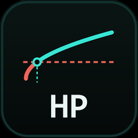

# HorizonProbe — is your holding time profitable *by construction*?

<p align="center"></p>

**Before asking whether your strategy predicts direction, ask whether direction is even worth predicting at your horizon.**

The toll you pay is fixed: you cross the spread once, whatever happens next. The move you are paid for is not: it grows roughly as the **square root** of the holding time. So there is always a horizon below which **even a perfect direction predictor loses money** — and the only honest way to find it is to measure it.

HorizonProbe is a single MQL5 script that measures it, horizon by horizon, on your broker's real data and your broker's real spread.

> **It never trades.** No orders, no positions, no account access, no `#include`. Copy the one file into any terminal and run it.

---

## What it prints

For every horizon you list (in minutes), over every sliding window in your history:

| output | what it is |
|---|---|
| **Ceiling (median cost)** | share of windows where \|close(t+H) − close(t)\| **exceeds** the median round-trip cost |
| **Ceiling (per-window cost)** | the same count, but each window judged at the spread **actually observed at its entry** |
| ★ **Oracle expectation** | `mean(\|d\|) − cost` — **this is the profitability judge** |
| **Break-even rate** | `0.5 + cost / (2 × mean\|d\|)` — the directional accuracy you need just to cover costs |
| **Windows kept** | and the **non-overlapping equivalent** (≈ used/H), because sliding windows are not independent draws |

### ★ The two ceilings are not decoration — their gap is a measurement

A constant cost flatters you. **Gold's spread explodes exactly when the move is large**, so judging a news minute at the toll of a quiet hour *overstates* the ceiling. Printing both numbers turns that bias from an assumption into a figure you can read.

### ★★ The ceiling is not the verdict — and this trips people up

The **ceiling** counts windows that individually clear the toll. The **expectation** is `mean|d| − cost`.

An oracle with perfect direction earns `(|d| − cost)` on *every* window, so it is profitable **if and only if `mean(|d|) > cost`**. With fat tails — and gold's tails are fat, median ≪ mean — **an oracle can be strongly profitable while fewer than half the windows clear the toll.** Reading the ceiling as the verdict is systematically *pessimistic*, precisely on the instruments where this tool is most useful.

The script says so in its own output, because getting this backwards costs you a strategy you should have kept.

---

## Why measure instead of estimate

The usual shortcut is √t scaling plus a Gaussian. It is wrong in the direction that matters: a Gaussian **under-states the large moves**, which are exactly the ones that pay for the toll. HorizonProbe does no scaling and assumes no distribution — it walks every sliding window and counts.

★ **A real result from using it.** On XAUUSD, an estimate placed the profitability flip at around 30 minutes. The measurement put it at **5 minutes** — a six-fold difference, and enough to reverse a verdict about an entire family of short-horizon strategies. Estimating that number and measuring it are not the same activity.

For scale, on the same instrument at M15: **median bar amplitude ≈ 140 points, median spread 14–20 points**. The toll is 10–14 % of a typical move. That ratio is what this script tracks across horizons.

---

## Install and run

1. **File → Open Data Folder** in MetaTrader 5, then drop `HorizonProbe.mq5` into `MQL5/Scripts/HorizonProbe/`.
2. Open MetaEditor (**F4**) and compile with **F7**. Expect `0 errors, 0 warnings`.
3. ⚠️ **Tools → Options → Charts → Max bars in chart** → *Unlimited*, then hold **`Home`** on the chart until it stops scrolling back. The script reads what the terminal has **cached**; the cap truncates silently and raises nothing.
4. **Navigator (Ctrl+N) → Scripts → HorizonProbe**, drop it on any chart of the symbol. It reads **M1** regardless of the chart period.

```bash
git clone https://github.com/Sjrazaviebra/HorizonProbe.git
```

| input | default | meaning |
|---|---|---|
| `HP_Horizons` | `1,2,5,10,15,30,60,120` | horizons in **minutes**, comma-separated, integers only |
| `HP_MaxBars` | `500000` | upper bound on the M1 history read |
| `HP_DateFrom` / `HP_DateTo` | `1970.01.01` | measured period; `1970` means *all history read* |
| `HP_Lots` | `0.01` | display only — converts points to currency, changes **no ratio** |

Results go to the **Experts** tab.

★ **It refuses loudly rather than measuring quietly.** A malformed or duplicated horizon, insufficient history, a truncated read — each stops the run with a stated reason. A silently truncated measurement is worse than no measurement.

---

## Reading notes, stated in the output

- **Sliding windows overlap** (they share H−1 minutes) and are **not independent draws**. The non-overlapping equivalent (≈ used/H) is published, and it is that number which carries any sample-size rule.
- **Strict counting**: a move exactly *equal* to the cost does not pay the toll and is not counted.
- `MARGE = CEILING − BREAK-EVEN` is printed for reference, but ⚠️ it **subtracts two rates of different natures** — a share of windows minus a required accuracy. Read it as an indicator, **never as the verdict**. The verdict is the expectation.
- Gaps are reported as measured *durations* (`≥ 30 min` / `< 30 min`). The script does not claim to tell a weekend from a data hole — it reports what it saw.

## Limits

- Reads **M1** and aggregates from it; horizons are expressed in minutes.
- Measures the market and its cost, **not a strategy**. A viable horizon is a *necessary* condition, never a sufficient one.
- Cost is the round-trip spread. Commission and swap, if your account has them, are yours to add.

## Licence

Source-available for reference, evaluation and demonstration. See [LICENSE](LICENSE).

Built by **Javad Razavi** — *The Solution Maker* · [javadrazavi.fr](https://javadrazavi.fr)

See also **[DataForge](https://github.com/Sjrazaviebra/DataForge)** — the same idea applied to the data itself: know what is really inside your bars before you train on them.
